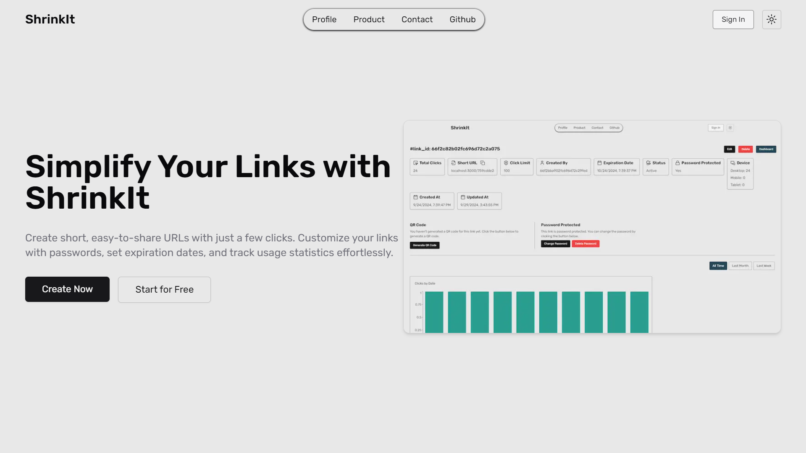
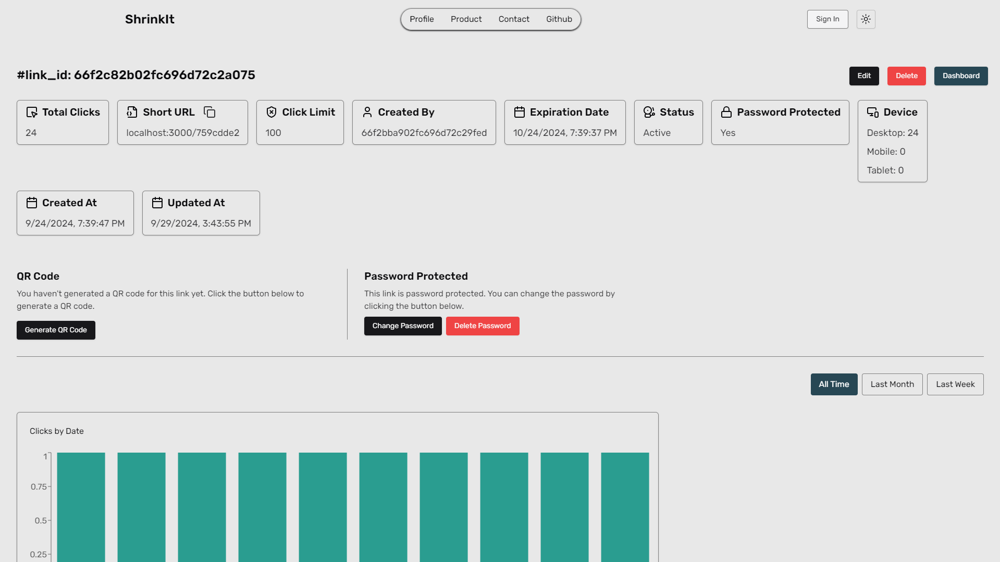
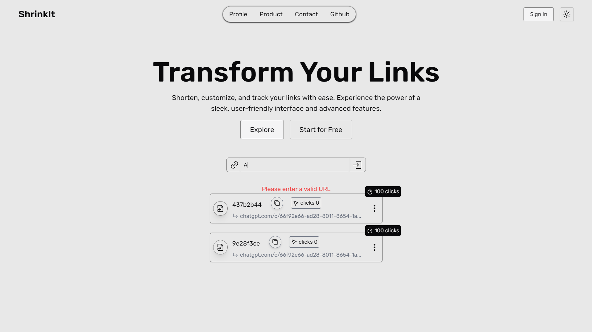
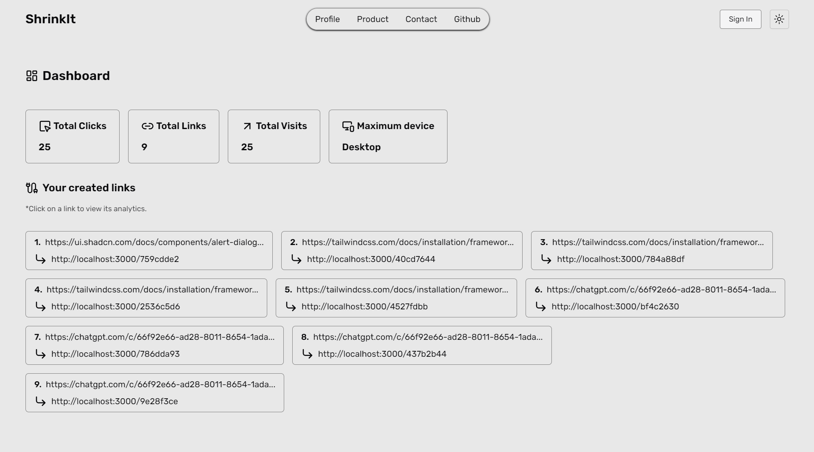
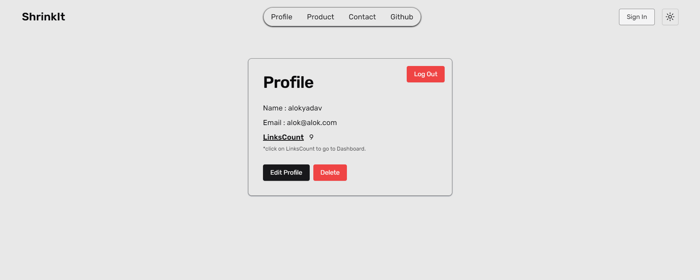

# ShrinkIt

ShrinkIt is a modern URL shortener application built with **Next.js**, leveraging a **MongoDB** database for storage. The application features a sleek and responsive design using **Tailwind CSS** and provides engaging animations with **Framer Motion**. ShrinkIt enables users to easily shorten long URLs while offering additional management features for logged-in users.

## Features

-   **URL Shortening**: Quickly convert long URLs into shorter, shareable links.
-   **User Authentication**: Secure sign-up and login for users to manage their links.
-   **Link Management**: Authenticated users can view, edit, and delete their shortened links.
-   **Link Options for Logged-in Users**:

    -   Password protection for links.
    -   Setting expiration time for links.
    -   Limiting the number of uses for each link.
    -   QR code generation for links.

-   **Dynamic Animations**: Enhancements using Framer Motion for smoother user experience.

## Tech Stack

-   **Frontend**: Next.js, Tailwind CSS, Framer Motion
-   **Backend**: Next.js API routes
-   **Database**: MongoDB
-   **Authentication**: JWT (JSON Web Tokens)

## Installation

### Clone the Repository

```bash
git clone https://github.com/alok-x0s1/ShrinkIt.git
cd ShrinkIt
```

### Install Dependencies

```bash
npm install
```

### Set Up Environment Variables

Create a `.env` file in the root directory and add the following variables:

```bash
MONGO_URI=<your-mongodb-uri>
DOMAIN=<your-domain>
ACCESS_TOKEN_SECRET=<your-access-token-secret>
ACCESS_TOKEN_EXPIRY=<your-access-token-expiry>
REFRESH_TOKEN_SECRET=<your-refresh-token-secret>
REFRESH_TOKEN_EXPIRY=<your-refresh-token-expiry>
```

### Start the Development Server

```bash
npm run dev
```

# Overview

## Home Page



Click on `Create Now` button to create a new link. If you are not logged in, you will be redirected to the login page.

Or click on `Start for Free` button to login to your account.

## Link Page



Here you can see the analytics of the link.

### Also you have options to

-   Edit the link
-   Delete the link
-   Copy the link
-   Generate, view, download, share,and delete the QR code
-   Add password to the link and change it.
-   Set expiration date to the link
-   Limit the number of uses of the link

## Create Page



Here you can create a new link.
Add add some options to your link.

## Dashboard Page



Here you can see all the links you have created.

## Profile Page



Here you can see your profile.

-   Edit your profile
-   Change your password
-   Delete your account
-   Logout

# Contributing

We welcome contributions to ShrinkIt! If you have any ideas or suggestions, please open an issue or submit a pull request.

# Contact

If you have any questions or feedback, please contact me on [alok-x0s1](https://github.com/alok-x0s1).
